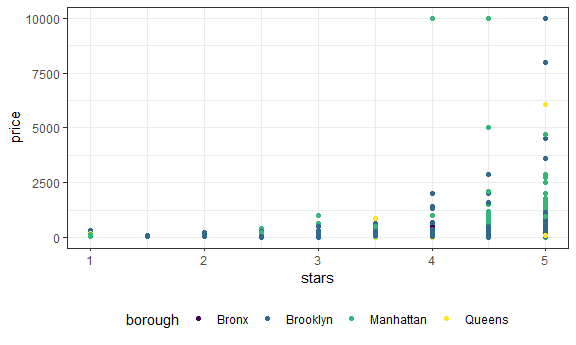
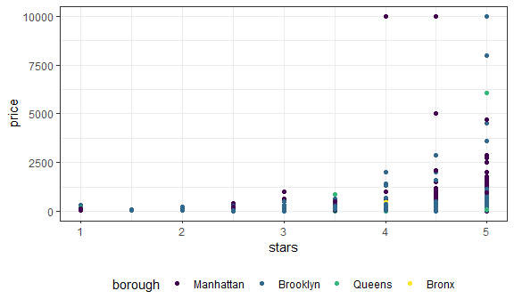

linear_models
================

``` r
nyc_airbnb = read_csv("./data/nyc_airbnb.csv")
```

    ## Rows: 40753 Columns: 17
    ## ── Column specification ────────────────────────────────────────────────────────
    ## Delimiter: ","
    ## chr   (5): name, host_name, neighbourhood_group, neighbourhood, room_type
    ## dbl  (11): id, review_scores_location, host_id, lat, long, price, minimum_ni...
    ## date  (1): last_review
    ## 
    ## ℹ Use `spec()` to retrieve the full column specification for this data.
    ## ℹ Specify the column types or set `show_col_types = FALSE` to quiet this message.

``` r
nyc_airbnb = 
  nyc_airbnb %>% 
  mutate(stars = review_scores_location / 2) %>% 
  rename(
    borough = neighbourhood_group,
    neighborhood = neighbourhood) %>% 
  filter(borough != "Staten Island") %>% 
  select(price, stars, borough, neighborhood, room_type)
```

## Fit a Model

``` r
nyc_airbnb %>% 
  ggplot(aes(x = stars, y = price, color = borough)) +
  geom_point()
```

    ## Warning: Removed 9962 rows containing missing values (geom_point).



``` r
fit = lm(price ~ stars + borough, data = nyc_airbnb)
```

Let’s look at the result

``` r
broom::glance(fit)
```

    ## # A tibble: 1 × 12
    ##   r.squared adj.r.…¹ sigma stati…²   p.value    df  logLik    AIC    BIC devia…³
    ##       <dbl>    <dbl> <dbl>   <dbl>     <dbl> <dbl>   <dbl>  <dbl>  <dbl>   <dbl>
    ## 1    0.0342   0.0341  182.    271. 6.73e-229     4 -2.02e5 4.04e5 4.04e5  1.01e9
    ## # … with 2 more variables: df.residual <int>, nobs <int>, and abbreviated
    ## #   variable names ¹​adj.r.squared, ²​statistic, ³​deviance
    ## # ℹ Use `colnames()` to see all variable names

``` r
broom::tidy(fit) %>% 
  select(-std.error, -statistic) %>%
  mutate(
    term = str_replace(term, "borough", "Borough")
  ) %>% 
  knitr::kable(digits = 3)
```

| term             | estimate | p.value |
|:-----------------|---------:|--------:|
| (Intercept)      |  -70.414 |   0.000 |
| stars            |   31.990 |   0.000 |
| BoroughBrooklyn  |   40.500 |   0.000 |
| BoroughManhattan |   90.254 |   0.000 |
| BoroughQueens    |   13.206 |   0.145 |

## Be in control of factors

``` r
nyc_airbnb =
  nyc_airbnb %>% 
  mutate(
    borough = fct_infreq(borough),
    room_type = fct_infreq(room_type)
  )
```

``` r
nyc_airbnb %>% 
  ggplot(aes(x = stars, y = price, color = borough)) +
  geom_point()
```

    ## Warning: Removed 9962 rows containing missing values (geom_point).



``` r
fit = lm(price ~ stars + borough, data = nyc_airbnb)

broom::tidy(fit)
```

    ## # A tibble: 5 × 5
    ##   term            estimate std.error statistic   p.value
    ##   <chr>              <dbl>     <dbl>     <dbl>     <dbl>
    ## 1 (Intercept)         19.8     12.2       1.63 1.04e-  1
    ## 2 stars               32.0      2.53     12.7  1.27e- 36
    ## 3 boroughBrooklyn    -49.8      2.23    -22.3  6.32e-109
    ## 4 boroughQueens      -77.0      3.73    -20.7  2.58e- 94
    ## 5 boroughBronx       -90.3      8.57    -10.5  6.64e- 26

``` r
broom::glance(fit)
```

    ## # A tibble: 1 × 12
    ##   r.squared adj.r.…¹ sigma stati…²   p.value    df  logLik    AIC    BIC devia…³
    ##       <dbl>    <dbl> <dbl>   <dbl>     <dbl> <dbl>   <dbl>  <dbl>  <dbl>   <dbl>
    ## 1    0.0342   0.0341  182.    271. 6.73e-229     4 -2.02e5 4.04e5 4.04e5  1.01e9
    ## # … with 2 more variables: df.residual <int>, nobs <int>, and abbreviated
    ## #   variable names ¹​adj.r.squared, ²​statistic, ³​deviance
    ## # ℹ Use `colnames()` to see all variable names
